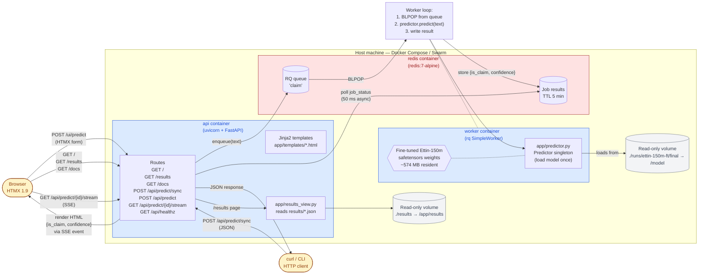
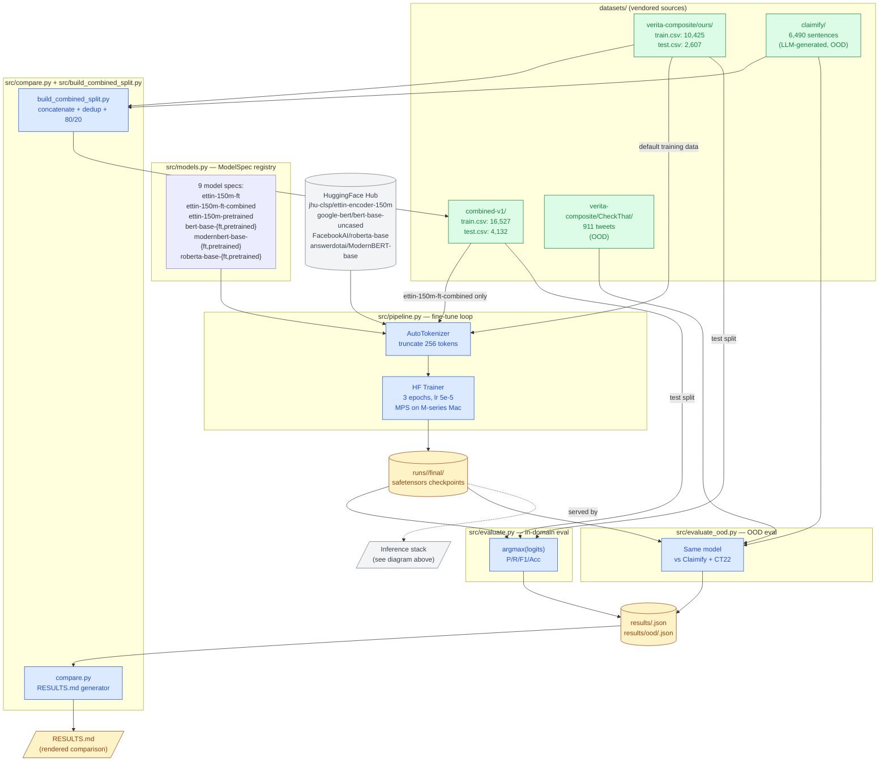

# Architecture

Two views of the system: the **runtime/inference stack** (what the
deployed Docker stack actually does on a request) and the **training
pipeline** (the offline path that produces the model checkpoints).

Both diagrams are [Mermaid](https://mermaid.js.org/) — render natively
on GitHub, in VS Code with the Markdown Preview, and in any modern
docs site. The same diagrams are also available as an Excalidraw file
([`architecture.excalidraw`](architecture.excalidraw)) if you want a
polished presentation-quality version that you can drag-and-drop into
<https://excalidraw.com> to edit.

---

## Runtime / inference stack

What happens when a user types a sentence at <https://localhost:8000/>
or `curl`s `POST /api/predict/sync`.

### Request flow, plain English

1. User types a sentence in the browser → HTMX `POST /ui/predict`.
2. **api** container puts a job on the **redis** queue, returns an
   HTML row fragment that opens an SSE stream.
3. **worker** container's `BLPOP` returns the job. Predictor — already
   in-memory from container start — runs `tokenize → forward pass →
   softmax`. Result `{is_claim, confidence, label}` lands back in
   redis.
4. **api**'s SSE handler (50 ms async polling) sees the new result,
   emits an `event: result` HTML fragment.
5. HTMX swaps the result HTML into the page row in place. No JS
   parsing, no client-side rendering.

Round-trip wall clock under load: **~150 ms steady state** (90 ms
inference + 25 ms avg poll wait + 30 ms HTTP). Sync mode (`QUEUE=0`,
no redis): ~80 ms — predictor runs in-process in the api container.

For the `curl POST /api/predict/sync` path: same internal flow, but
the api endpoint blocks on the same status-poll loop and returns the
final JSON in one HTTP round-trip.

---

## Training & evaluation pipeline

The offline path that produces the checkpoints in `runs/`. Runs once
per model on the M4 Air; outputs feed the inference stack above.

### Pipeline flow, plain English

1. **Vendor** training data into `datasets/` (one-time; everything
   normalized to `text,label,source` CSV).
2. **Pick** a model from the registry in `src/models.py`. Each spec
   says: HF id, fine-tune or frozen probe, optional override of the
   training corpus (`data_dir`).
3. **Train**: `python -m src.pipeline --model <slug>` pulls the
   pretrained weights from HF Hub, tokenizes the configured training
   set, runs HF `Trainer` for 3 epochs on MPS, saves the checkpoint
   under `runs/<slug>/final/`.
4. **Evaluate** in-domain: `python -m src.evaluate --model <slug>`
   loads the checkpoint, predicts on the matching test split, writes
   metrics to `results/<slug>.json`.
5. **Evaluate** OOD: `python -m src.evaluate_ood --model <slug>`
   predicts the same checkpoint against Claimify + CT22, writes to
   `results/ood/<slug>.json`.
6. **Compare**: `python -m src.compare` aggregates every JSON in
   `results/` into a markdown table with column-best bolding,
   in-domain table, OOD table, side-by-side vs the Bell paper.
7. **Serve**: the inference stack mounts `runs/ettin-150m-ft/final/`
   as `/model` and the predictor loads it once at worker boot.

The whole 8-model sweep (4 fine-tunes + 4 frozen probes + 1 combined-v1
re-run of Ettin) takes ~4 hours wall clock on the M4 Air, no cloud.

---

## Editing these diagrams

### Mermaid (this file)

Edit the `mermaid` code blocks above. To preview locally:

- **VS Code**: install the [Markdown Preview Mermaid Support](https://marketplace.visualstudio.com/items?itemName=bierner.markdown-mermaid)
  extension, then open this file with `Cmd+Shift+V`.
- **GitHub**: just commit and view on github.com — Mermaid is rendered
  natively in `.md` files.
- **CLI**: `npm i -g @mermaid-js/mermaid-cli && mmdc -i ARCHITECTURE.md -o arch.png`.

### Excalidraw

`architecture.excalidraw` is a JSON file. Three ways to edit:

- **In-browser**: drag the file into <https://excalidraw.com>. Runs
  fully client-side, nothing leaves your machine. Save back over the
  file when done.
- **VS Code**: install the
  [Excalidraw Editor](https://marketplace.visualstudio.com/items?itemName=pomdtr.excalidraw-editor)
  extension and open `architecture.excalidraw` directly.
- **Self-host**: `docker run -p 80:80 excalidraw/excalidraw` — same
  app, served from your machine.
